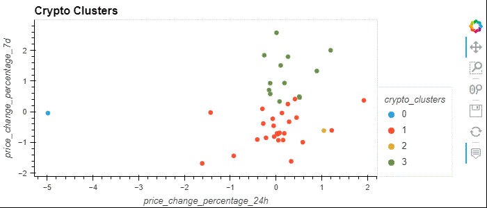
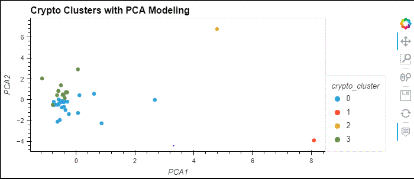

# Homework 10: Crypto Clustering

### By: Yen

## Crypto Clustering 
### Contain a tool (crypto_investments.ipynb) that analyzes cryptocurrencies and its performance in different time periods. It groups into clusters for better visualization of the performance.  

### Using K-mean Algorithm with Original to cluster crypto:

### Using K-mean Algorithm with Principal Component Analysis (PCA) to cluster crypto:

